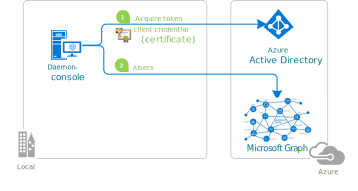

# A simple Python daemon console application calling Microsoft Graph with its own identity (client certificate variation)

## About this sample

### Overview

This sample application shows how to use the [Microsoft identity platform endpoint](http://aka.ms/aadv2) to access the data of Microsoft business customers in a long-running, non-interactive process.  It uses the [OAuth 2 client credentials grant](https://docs.microsoft.com/en-us/azure/active-directory/develop/v2-oauth2-client-creds-grant-flow) to acquire an access token, which can be used to call the [Microsoft Graph](https://graph.microsoft.io) and access organizational data.

The app is a Python Console application. It gets the list of users in an Azure AD tenant by using `Microsoft Authentication Library (MSAL) for Python` to acquire a token.

## Scenario

The console application:

- gets a token from microsoft identity platform in its own name (without a user)
- and then calls the Microsoft Graph /users endpoint to get the list of user, which it then displays (as Json blob)



For more information on the concepts used in this sample, be sure to read the [Daemon app scenario](https://docs.microsoft.com/azure/active-directory/develop/scenario-daemon-overview) and, if you're insterested in protocol details, the [Microsoft identity platform endpoint client credentials protocol documentation](https://azure.microsoft.com/documentation/articles/active-directory-v2-protocols-oauth-client-creds).

> ### Daemon applications can use two forms of secrets to prove their identity to the Microsoft identity platform:
>
> - **application secrets**. This is the object of the other folder: [../1-Call-MsGraph-WithSecret](../1-Call-MsGraph-WithSecret) folder
> - **certificates**, in this folder

## How to run this sample

To run this sample, you'll need:

> - [Python 2.7+](https://www.python.org/downloads/release/python-2713/) or [Python 3+](https://www.python.org/downloads/release/python-364/)
> - An Azure Active Directory (Azure AD) tenant. For more information on how to get an Azure AD tenant, see [how to get an Azure AD tenant.](https://docs.microsoft.com/azure/active-directory/develop/quickstart-create-new-tenant)

### Step 1:  Clone or download this repository

From your shell or command line:

```Shell
git clone https://github.com/Azure-Samples/ms-identity-python-daemon.git
```

Go to the `"2-Call-MsGraph-WithCertificat"` folder

```Shell
cd 2-Call-MsGraph-WithCertificate
```

or download and extract the repository .zip file.

> Given that the name of the sample is pretty long, you might want to clone it in a folder close to the root of your hard drive, to avoid file size limitations on Windows.

### Step 2:  Register the sample with your Azure Active Directory tenant

There is one project in this sample. To register it, you can:

- either follow the steps [Step 2: Register the sample with your Azure Active Directory tenant](#step-2-register-the-sample-with-your-azure-active-directory-tenant) and [Step 3:  Configure the sample to use your Azure AD tenant](#choose-the-azure-ad-tenant-where-you-want-to-create-your-applications)
- or use PowerShell scripts that:
  - **automatically** creates the Azure AD applications and related objects (passwords, permissions, dependencies) for you
  - modify the Visual Studio projects' configuration files.

If you want to use this automation:
1. On Windows run PowerShell and navigate to the root of the cloned directory
1. In PowerShell run:
   ```PowerShell
   Set-ExecutionPolicy -ExecutionPolicy RemoteSigned -Scope Process -Force
   ```
1. Run the script to create your Azure AD application and configure the code of the sample application accordingly. 
   ```PowerShell
   .\AppCreationScripts\Configure.ps1
   ```
   > Other ways of running the scripts are described in [App Creation Scripts](./AppCreationScripts/AppCreationScripts.md)

1. Run the sample
   You'll need to install the dependencies using pip as follows:
  
   ```Shell
    pip install -r requirements.txt
    ```

    Run `confidential_client_certificate_sample.py` with the parameters for the app:

   ```Shell
   python confidential_client_certificate_sample.py parameters.json
   ```

If you don't want to use this automation, follow the steps below:

#### Choose the Azure AD tenant where you want to create your applications

As a first step you'll need to:

1. Sign in to the [Azure portal](https://portal.azure.com) using either a work or school account or a personal Microsoft account.
1. If your account is present in more than one Azure AD tenant, select `Directory + Subscription` at the top right corner in the menu on top of the page, and switch your portal session to the desired Azure AD tenant.
1. In the left-hand navigation pane, select the **Azure Active Directory** service, and then select **App registrations**.

#### (Optional) Create a self-signed certificate

To generate certificate and private key to be used when implementing the client credential flow are as follows:

1. Generate a key:

   ``` openssl genrsa -out server.pem 2048 ```

2. Create a certificate request:

   ```openssl req -new -key server.pem -out server.csr```

3. Generate a certificate:

   ```openssl x509 -req -days 365 -in server.csr -signkey server.pem -out server.crt```

4. You will have to upload this certificate (`server.crt`) on Azure Portal (See next step). Once you save this certificate, the portal will give you the thumbprint of this certificate which is needed in the acquire token call. The key will be the `server.pem` key you generated in the first step.

Alternatively you can use an existing certificate if you have one.

#### Register the client app (daemon-console)

1. Navigate to the Microsoft identity platform for developers [App registrations](https://go.microsoft.com/fwlink/?linkid=2083908) page.
1. Select **New registration**.
   - In the **Name** section, enter a meaningful application name that will be displayed to users of the app, for example `daemon-console`.
   - In the **Supported account types** section, select **Accounts in this organizational directory only ({tenant name})**.
   - Select **Register** to create the application.
1. On the app **Overview** page, find the **Application (client) ID** value and record it for later. You'll need it to configure the Visual Studio configuration file for this project.
1. In the **Certificates & secrets** page, in the **Certificates** section:
   - Click on **Upload certificate** and, in click the browse button on the right to select the certificate you just exported (`server.pem` or your existing certificate)
   - Click **Add**
1. In the list of pages for the app, select **API permissions**
   - Click the **Add a permission** button and then,
   - Ensure that the **Microsoft APIs** tab is selected
   - In the *Commonly used Microsoft APIs* section, click on **Microsoft Graph**
   - In the **Application permissions** section, ensure that the right permissions are checked: **User.Read.All**
   - Select the **Add permissions** button

1. At this stage permissions are assigned correctly but the client app does not allow interaction.
   Therefore no consent can be presented via a UI and accepted to use the service app.
   Click the **Grant/revoke admin consent for {tenant}** button, and then select **Yes** when you are asked if you want to grant consent for the
   requested permissions for all account in the tenant.
   You need to be an Azure AD tenant admin to do this.

### Step 3:  Configure the sample to use your Azure AD tenant

In the steps below, "ClientID" is the same as "Application ID" or "AppId".

Open the `parameters.json` file

#### Configure the client project

> Note: if you used the setup scripts, the changes below will have been applied for you

1. Open the `parameters.json` file
1. Find the string key `organizations` in the `authority` variable and replace the existing value with your Azure AD tenant name.
1. Find the string key `your_client_id` and replace the existing value with the application ID (clientId) of the `daemon-console` application copied from the Azure portal.
1. Find the string key `790E... The thumbprint generated by AAD when you upload your public cert` and replace the existing value with the thumbprint of the certificate you got when uploading the certificate in the  `daemon-console` app, in the Azure portal.

### Step 4: Run the sample

You'll need to install the dependencies using pip as follows:
  
```Shell
pip install -r requirements.txt
```

Start the application, it will display some Json string containing the users in the tenant.

```Shell
python confidential_client_certificate_sample.py parameters.json
```

## About the code

The relevant code for this sample is in the `confidential_client_secret_sample.py` file. The steps are:

1. Create the MSAL confidential client application.

    Important note: even if we are building a console application, it is a daemon, and therefore a confidential client application, as it does not
    access Web APIs on behalf of a user, but on its own application behalf.

    ```Python
    app = msal.ConfidentialClientApplication(
        config["client_id"], authority=config["authority"],
        client_credential={"thumbprint": config["thumbprint"], "private_key": open(config['private_key_file']).read()},
        )
    ```

2. Define the scopes.

   Specific to client credentials, you don't specify, in the code, the individual scopes you want to access. You have statically declared
   them during the application registration step. Therefore the only possible scope is "resource/.default" (here "https://graph.microsoft.com/.default")
   which means "the static permissions defined in the application".

   In the parameters.json file you have:

    ```JSon
    "scope": [ "https://graph.microsoft.com/.default" ],
    ```

3. Acquire the token

    ```Python
    # The pattern to acquire a token looks like this.
    result = None

    # Firstly, looks up a token from cache
    # Since we are looking for token for the current app, NOT for an end user,
    # notice we give account parameter as None.
    result = app.acquire_token_silent(config["scope"], account=None)

    if not result:
    logging.info("No suitable token exists in cache. Let's get a new one from AAD.")
    result = app.acquire_token_for_client(scopes=config["scope"])
    ```

4. Call the API

    In that case calling "https://graph.microsoft.com/v1.0/users" with the access token as a bearer token.

    ```Python
    if "access_token" in result:
        # Calling graph using the access token
        graph_data = requests.get(  # Use token to call downstream service
        config["endpoint"],
        headers={'Authorization': 'Bearer ' + result['access_token']}, ).json()
    print("Users from graph: " + str(graph_data))
    else:
        print(result.get("error"))
        print(result.get("error_description"))
        print(result.get("correlation_id"))  # You may need this when reporting a bug
    ```

## Troubleshooting

### Did you forget to provide admin consent? This is needed for daemon apps

If you get an error when calling the API `Insufficient privileges to complete the operation.`, this is because the tenant administrator has not granted permissions
to the application. See step 6 of [Register the client app (daemon-console)](#register-the-client-app-daemon-console) above.

You will typically see, on the output window, something like the following:

```Json
Failed to call the Web Api: Forbidden
Content: {
  "error": {
    "code": "Authorization_RequestDenied",
    "message": "Insufficient privileges to complete the operation.",
    "innerError": {
      "request-id": "<a guid>",
      "date": "<date>"
    }
  }
}
```

## Variation: daemon application using client credentials with client secret

For the other variation, see [../1-Call-MsGraph-WithSecret](../1-Call-MsGraph-WithSecret)

## Community Help and Support

Use [Stack Overflow](http://stackoverflow.com/questions/tagged/msal) to get support from the community.
Ask your questions on Stack Overflow first and browse existing issues to see if someone has asked your question before.
Make sure that your questions or comments are tagged with [`msal` `python`].

If you find a bug in the sample, please raise the issue on [GitHub Issues](../../issues).

If you find a bug in Msal Python, please raise the issue on [MSAL Python GitHub Issues](https://github.com/AzureAD/microsoft-authentication-library-for-python/issues).

To provide a recommendation, visit the following [User Voice page](https://feedback.azure.com/forums/169401-azure-active-directory).

## Contributing

If you'd like to contribute to this sample, see [CONTRIBUTING.MD](/CONTRIBUTING.md).

This project has adopted the [Microsoft Open Source Code of Conduct](https://opensource.microsoft.com/codeofconduct/). For more information, see the [Code of Conduct FAQ](https://opensource.microsoft.com/codeofconduct/faq/) or contact [opencode@microsoft.com](mailto:opencode@microsoft.com) with any additional questions or comments.

## More information

For more information, see MSAL.NET's conceptual documentation:

- [Quickstart: Register an application with the Microsoft identity platform](https://docs.microsoft.com/azure/active-directory/develop/quickstart-register-app)
- [Quickstart: Configure a client application to access web APIs](https://docs.microsoft.com/azure/active-directory/develop/quickstart-configure-app-access-web-apis)
- [Daemon app scenario](https://docs.microsoft.com/azure/active-directory/develop/scenario-daemon-overview)

For more information about the underlying protocol:

- [Microsoft identity platform and the OAuth 2.0 client credentials flow](https://docs.microsoft.com/en-us/azure/active-directory/develop/v2-oauth2-client-creds-grant-flow)