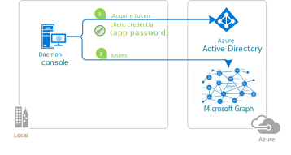

# A Python console daemon app calling Microsoft Graph

<!-- 
Guidelines on README format: https://review.docs.microsoft.com/help/onboard/admin/samples/concepts/readme-template?branch=master

Guidance on onboarding samples to docs.microsoft.com/samples: https://review.docs.microsoft.com/help/onboard/admin/samples/process/onboarding?branch=master

Taxonomies for products and languages: https://review.docs.microsoft.com/new-hope/information-architecture/metadata/taxonomies?branch=master
-->

## About this sample

### Scenario

You want to write a daemon application that consumes organizational data using Microsoft Graph and using **Microsoft Identity Platform** to acquire tokens.

For details see [Daemon apps scenario](https://docs.microsoft.com/en-us/azure/active-directory/develop/scenario-daemon-overview).

### Structure of the repository

This repository contains a progressive tutorial made of two parts:

Sub folder                    | Description
----------------------------- | -----------
[1-Call-MsGraph-WithSecret](https://github.com/Azure-Samples/ms-identity-python-daemon/tree/master/1-Call-MsGraph-WithSecret) | This sample application shows how to use the Microsoft identity platform endpoint to access the data of Microsoft business customers in a long-running, non-interactive process. The daemon application proves its identity using a **client secret**. It uses the OAuth 2 client credentials grant to acquire an access token, which can be used to call the Microsoft Graph and access organizational data </p> 
[2-Call-MsGraph-WithCertificate](https://github.com/Azure-Samples/ms-identity-python-daemon/tree/master/2-Call-MsGraph-WithCertificate)  | This variation of the first sample shows how the application proves its identity using a **certificate**. </p>  

## Prerequisites

To run this sample, you'll need:

> - [Python 2.7+](https://www.python.org/downloads/release/python-2713/) or [Python 3+](https://www.python.org/downloads/release/python-364/)
> - MSAL Python
>   ```Python
>   pip msal
>   ```
> - An Azure Active Directory (Azure AD) tenant. For more information on how to get an Azure AD tenant, see [how to get an Azure AD tenant.](https://docs.microsoft.com/azure/active-directory/develop/quickstart-create-new-tenant)

## Setup and run the sample

Download and extract the repository .zip file or, from your shell or command line:

```Shell
git clone https://github.com/Azure-Samples/ms-identity-python-daemon.git
```

Then, see the readme of each sub-folder to understand how to setup and run the samples, and learn key concepts.

## Contributing

This project welcomes contributions and suggestions.  Most contributions require you to agree to a
Contributor License Agreement (CLA) declaring that you have the right to, and actually do, grant us
the rights to use your contribution. For details, visit https://cla.opensource.microsoft.com.

When you submit a pull request, a CLA bot will automatically determine whether you need to provide
a CLA and decorate the PR appropriately (e.g., status check, comment). Simply follow the instructions
provided by the bot. You will only need to do this once across all repos using our CLA.

This project has adopted the [Microsoft Open Source Code of Conduct](https://opensource.microsoft.com/codeofconduct/).
For more information see the [Code of Conduct FAQ](https://opensource.microsoft.com/codeofconduct/faq/) or
contact [opencode@microsoft.com](mailto:opencode@microsoft.com) with any additional questions or comments.
